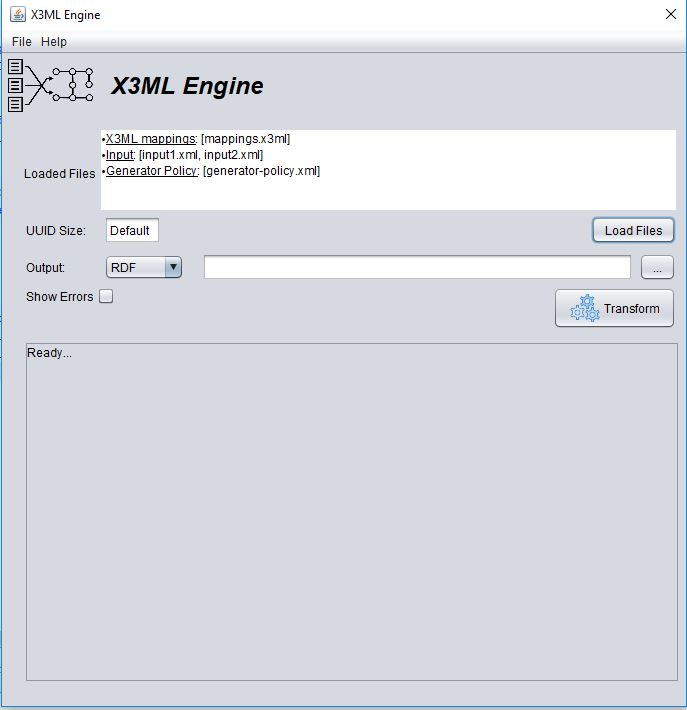

# X3ML Engine
---

### Table of Contents

* **[Introduction](#introduction)**
* **[X3ML Language](#x3ml-language)**
* **[Development](#development)**
	* **[Project Structure](#project-structure)**
	* **[Design Principles](#design-principles)**
* **[Download](#download)**
	* **[Official Releases](#official-releases)**
	* **[Maven Releases](#maven-releases)**
	* **[Maven SNAPSHOTs](#maven-snapshots)**
* **[License](#license)**
* **[How to Execute](#how-to-execute)**
	* **[Run from console](#run-from-console)**
	* **[Run through JAVA API](#run-through-java-api)**
	* **[Run using GUI application](#run-using-gui-application)**
* **[Relevant Publications](#relevant-publications)**

---

# Introduction

The X3ML engine handles the URI generation and the data transformation steps of the data provision and aggregation process. It realizes the transformation of the source records to the target's format. The engine takes as input the source data (currently in the form of an XML document), the description of the mappings in the X3ML mapping definition file and the URI generation policy file and is responsible for transforming the XML document into a valid RDF document which is equivalent with the XML input, with respect to the given mappings and policy. The engine has been originally implemented in the context of the CultureBrokers project co-funded by the Swedish Arts Council and the British Museum.

# X3ML Language

The X3ML mapping definition language is an XML based language which describes schema mappings in such a way that they can be collaboratively created and discussed by experts. The X3ML language was designed on the basis of work that started in FORTH in 2006 and emphasizes on establishing a standardized mapping description which lends itself to collaboration and the building of a mapping memory to accumulate knowledge and experience. It was adapted primarily to be more according to the DRY principle (avoiding repetition) and to be more explicit in its contract with the URI Generating process. X3ML separates schema mapping from the concern of generating proper URIs so that different expertise can be applied to these two very different responsibilities.

* **[X3ML Language](https://github.com/isl/x3ml/blob/master/docs/x3ml-language.md)** - the mapping language

# Development

This project is a straightforward Maven 3 project, producing a single artifact in the form of a JAR file which contains the engine software.  The artifact will be used in a variety of different contexts, so the main focus of this project is to create exhaustively tested transformation engine.  Examples of input and expected output have been prepared by the participating organizations.

* **[Change Log](https://github.com/isl/x3ml/blob/master/docs/change-log.md)** - Changes between versions

## Project Structure

The project is structured with respect to Maven principles and any important or useful resources are categorized to different folders. More specifically it contains the following folders:

* **src**: contains the source code of the X3ML engine and tests
* **docs**: contains the corresponding documentation material for relevant resources (i.e. specification of the X3ML language, changelog of the X3ML engine, etc.)
* **resources**: contains information about useful resources (i.e. the X3ML schema XSD files and their documentation)
* **example**: contains examples (i.e. XML and X3ML files) that can be used for demonstrating the functionality of X3ML Engine

## Design Principles

* **Simplicity**

	It is easier to create complicated things than it is to find the simplicity in something that would otherwise be complex.  One important way to achieve simplicity and clarity is by carefully naming things so that their meaning is as obvious as possible to the naked eye.
	
* **Transparency**

	The most important feature of X3ML is its general application to mapping creation and execution and hopefully its longevity.  People must be able to easily understand how it works.  The **cleaner** the core design of this engine and X3ML language, and the clearer its documentation, the more readily it will get traction and become the basis for future mappings.

* **Re-use of Standards and Technologies**

	The best way to build a new software module is to carefully choose its dependencies, and keeping them as small as possible.  Building on top of proven technologies is the quickest way to a dependable result.

	* **[XStream](http://xstream.codehaus.org/)** - easy reading/writing of XML 
	
	* **[Handy URI Templates](https://github.com/damnhandy/Handy-URI-Templates)** - standardized URI generation [RFC 6570](http://tools.ietf.org/html/rfc6570)
	
	* **[Jena](https://jena.apache.org/)** - in-memory building of graph for RDF output

* **Facilitating Instance Matching**

	An application of X3ML which came up during discussions at the beginning of this project involved extracting semantic information with the intent of finding correct instance URIs.  This implies a relatively small extension to the original idea of the X3ML engine because it will have to provide modified source records as well as RDF in its output.
	
	When [instance matching](http://prezi.com/povcuuboyyg5/culture-brokers-enrichment/) is performed and URIs are found, it must be explicitly known how to substitute them back into the source data.  The X3ML engine will decorate the source record tree with placeholders so that the results of the instance matching can find their way back to the right locations in the source.

# Download

## Official Releases

We regularly publish new [releases](https://github.com/isl/x3ml/releases) of the X3ML engine.
Each release contains the following: 
* *X3ML-Engine.jar*: it is a typical JAR files that contains all the functionalities of the X3ML Engine (without its dependent JARs).
* *X3ML-Engine-exejar.jar*: it is an executable JAR that contains all the functionalities of the X3ML Engine. This JAR file incorporates all the dependencies of the X3ML Engine and delivered as a single file. It is mainly produced and disseminated for executing X3ML Engine from [console](#run-from-console).

 More specifically we publish both official releases and releases under development. 

## Maven Releases

In addition, we publish X3ML Engine releases in a Maven repository so that they can be used from other JAVA developers. 
To use X3ML Engine simply use the repository shown below, as well as the dependency for the version you are looking for.

```xml
<repositories>
	<repository>
		<id>FORTH-ISL-releases</id>
		<name>FORTH ISL Nexus repository - Releases</name>		
		<url>http://athena.ics.forth.gr:8081/repository/FORTH-ISL-releases/</url>
        </repository>
</repositories>

<dependencies>
	<dependency>
		<groupId>gr.forth.ics.isl</groupId>
		<artifactId>x3ml-engine</artifactId>
		<version>1.9.1</version>
	</dependency>
</dependencies>
```

## Maven SNAPSHOTs

Furthermore, we publish the releases under development (SNAPSHOTs) in a Maven repository.
They are published every time new changes are pushed to [master branch](https://github.com/isl/x3ml/tree/master). 
To use a SNAPSHOT version of X3ML Engine, use the repository shown below,
as well as the dependency for the SNAPSHOT version you are looking for.

```xml
<repositories>
	<repository>
		<id>FORTH-ISL-snapshots</id>
		<name>FORTH ISL Nexus repository - Snapshots</name>		
		<url>http://athena.ics.forth.gr:8081/repository/FORTH-ISL-snapshots/</url>
        </repository>
</repositories>

<dependencies>
	<dependency>
		<groupId>gr.forth.ics.isl</groupId>
		<artifactId>x3ml-engine</artifactId>
		<version>1.9.2-SNAPSHOT</version>
	</dependency>
</dependencies>
```

# License

X3ML Engine is released under Apache License 2.0. It is A permissive license whose main conditions require preservation of copyright and license notices. Contributors provide an express grant of patent rights. Licensed works, modifications, and larger works may be distributed under different terms and without source code. You can find more detailed about the license in the corresponding [LICENSE file](https://github.com/isl/x3ml/blob/master/LICENSE) and at [https://www.apache.org/licenses/LICENSE-2.0.html](https://www.apache.org/licenses/LICENSE-2.0.html).

# How to Execute

X3ML Engine can be used either programmatically or directly from console. 

## Run from console

To run the x3ml engine from the console you need to download the x3ml engine executable .jar and execute it according to the following instructions:

* *-i,--input <arg>*: XML input records.
  * Option A-single file: --input input.xml
  * Option B-multiple files (comma-sep): --input input1.xml,input2.xml,input3.xml
  * Option C-folder: --input #_folder_path
  * Option D-URL: --input @input_url
  * Option E-multiple URLs: --input @input_url1,input_url2,input_url3
  * Option F-stdin: --input @
* *-x,--x3ml <arg>*: X3ML mapping definition.
  * Option A-single file: --x3ml mapping.x3ml
  * Option B-multiple files (comma-sep): --x3ml mappings1.x3ml,mappings2.x3ml
  * Option C-stdin: --x3ml @
* *-p,--policy <arg>*: The value policy file: --policy policy.xml
* *-o,--output <arg>*: The RDF output file name: --output output.rdf
* *-u,--uuidTestSize <arg>*:  Create a test UUID generator of the given size.
* *-f,--format <arg>*: Output format. Options:
	* --format application/rdf+xml (default)
 	* --format application/n-triples
 	* --format application/trig
  	* --format text/turtle
* *-t,--terms <arg>*: the SKOS taxonomy 
  * Option A-single file: --terms skosTerms.nt
  * Option B-URL file: --terms @skos_terms_url
* *-a,--assocTable <arg>*: export the contents of the association table in XML format
* *-m,--mergeAssocWithRDF*:merge the contents of the association table with the RDF output
	
A simple example looks like:

```shell
java -jar x3ml.jar -i input.xml -x mappings.x3ml -p generator-policy.xml -o output.rdf -u 4
```

## Run through JAVA API

X3ML Engine can created and executed programmatically using the X3MLEngineFactory class. 
A basic usage of the factory class is shown below.

```java
X3MLEngineFactory.create()
 		 .withInputFiles(new File("input.xml")) 
		 .withMappings(new File("mappings.x3ml"))
		 .withGeneratorPolicy(new File("generator-policy.xml"))
		 .withOutput(new File("output.rdf"), X3MLEngineFactory.OutputFormat.RDF_XML)
		 .execute();
```

Below we provide an explanation of the methods of the X3MLEngineFactory. 
Detailed documentation is available for developers in the form of Javadoc comments. 
* *create()*: creates a new instance of X3MLEngineFactory.
* *withInput()*: includes all the input resources to be transformed in the form of InputStreams, URLs. If more than one resources are provided, they should contain the same root element.
* *withInputFiles()*: includes all the input resources to be transformed in the form of Files. If more than one resources are provided, they should contain the same root element.
* *withInputFolder()*: includes all the input resources to be transformed in the form of a folder. If the folder contains more than  one resources, they should contain the same root element.
* *withMappings()*: includes the X3ML mappings in the form of Files, InputStreams, or URLs.
* *withGeneratoryPolicy()*: includes the generator policy in the form of a File, InputStream, or URL.
* *withOutput()*: identifies the output resource where the transformed data will be exported. The output resource can be either a File or an OutputStream. The output format can be one of: RDF_XML, NTRIPLES, TRIG, TURTLE.
* *withUuidSize()*: identifies the size of the UUID (works only for the default generator with name UUID).
* *withTerminology()*: identifies the terminology resources that will be used.
* *execute()*: executes the X3ML Engine using all the provided resources. If all the mandatory information are provided (i.e. input and mapping resources) it will result with the transformation of the data resources.


## Run using GUI application

X3ML Engine can be executed using a simple GUI application. The following figure shows an indicative snapshot of the application.
The GUI application can be downloaded from https://github.com/ymark/X3MLEngine-gui/releases/. 



# Relevant Publications

* 	Nikos Minadakis, Yannis Marketakis, Haridimos Kondylakis, Giorgos Flouris, Maria Theodoridou, Martin Doerr, and Gerald de Jong. X3ML Framework: An effictive suite for supporting data mappings. Workshop for Extending, Mapping and Focusing the CRM - co-located with TPDL'2015, Poznan, Poland, September 2015. [PDF] (http://users.ics.forth.gr/~marketak/download/x3mlEngine_tpdl2015.pdf)
* 	Yannis Marketakis, Nikos Minadakis, Haridimos Kondylakis, Konstantina Konsolaki, Georgios Samaritakis, Maria Theodoridou, Giorgos Flouris, Martin Doerr . X3ML Mapping Framework for Information Integration in Cultural Heritage and beyond. International Journal on Digital Libraries, Special Issue: Extending, Mapping and Focusing the CIDOC CRM (to be published 2016). [PDF] (http://users.ics.forth.gr/~marketak/download/X3ML_Framework_IJDL_2016.pdf)

---

## Contacts

* Martin Doerr &lt;martin@ics.forth.gr&gt;
* Minadakis Nikos &lt;minadakn@ics.forth.gr&gt;
* Marketakis Yannis &lt;marketak@ics.forth.gr&gt;

--- 

Last update: May 29, 2019
