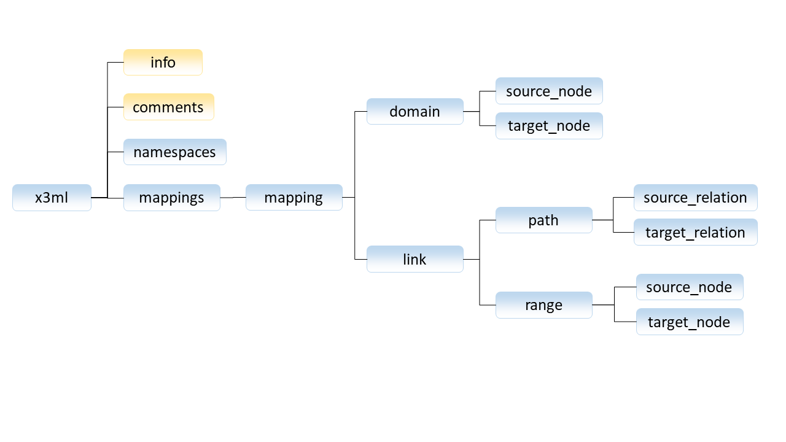
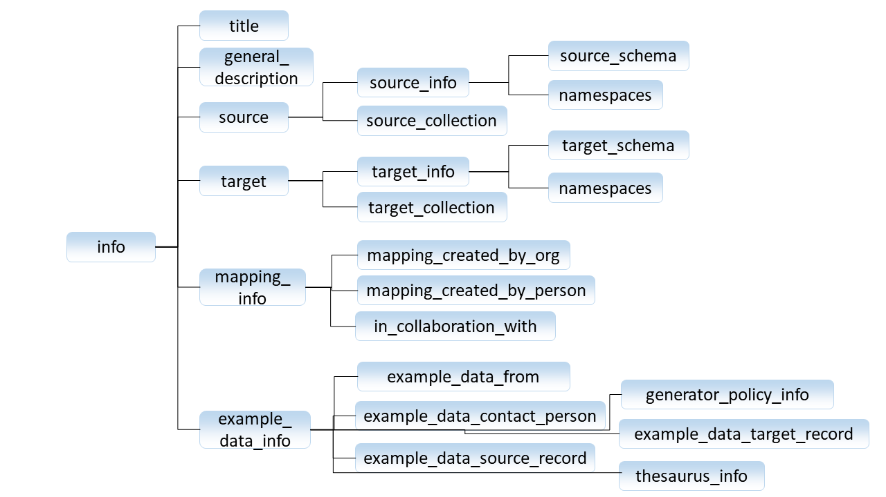
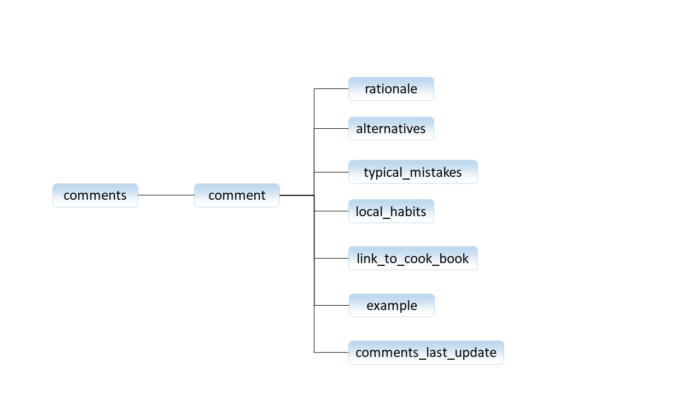
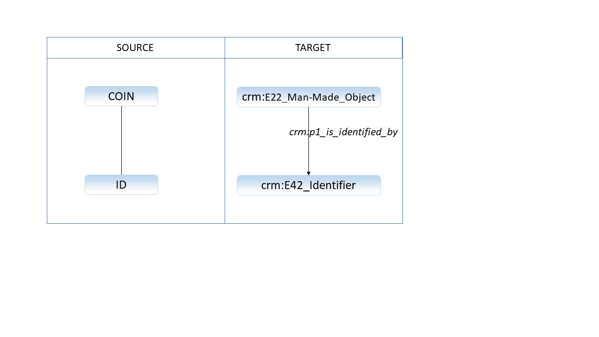
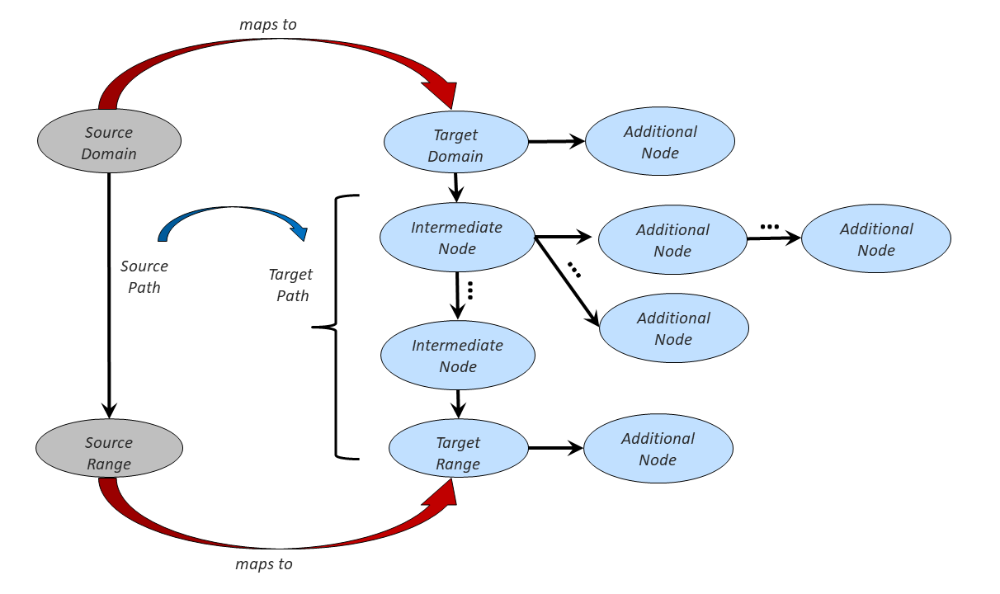

# X3ML Language
---

### Table of Contents

* **[Introduction](#introduction)**
* **[Mapping Metadata and Comments](#mapping-metadata-and-comments)**
	* **[Info Element](#info-element)**
	* **[Comments Element](#comments-element)**
* **[Structure of a Mapping](#structure-of-a-mapping)**
	* **[Source Node and Relation](#source-node-and-relation)**
 	* **[Target Entities and Relations](#target-entities-and-relations)**
	* **[An Indicative Mapping](#an-indicative-mapping)**
* **[Variables](#variables)**
	* **[Simple Variables](#simple-variables)**
	* **[Global Variables](#global-variables)**
* **[Conditions](#conditions)**
	* **[exists](#exists)**
	* **[equals](#equals)**
	* **[skos:exact_match](#skosexact_match)**
	* **[skos:broader](#skosbroader)**
	* **[Multiple Conditions](#multiple-conditions)**
* **[Extensions](#extensions)**
	* **[Additional Nodes](#additional-nodes)**
	* **[Intermediate Nodes](#intermediate-nodes)**
* **[Value Generation](#value-generation)**
	* **[Default Generators](#default-generators)**	
		* **[UUID](#uuid)**
		* **[Literal](#literal)**
		* **[rdfs:label](#rdfslabel)**
		* **[skos:prefLabel](#skospreflabel)**
	* **[Generator Policy File](#generator-policy-file)**
	* **[Simple Templates](#simple-templates)**
		* **[Literals with Templates](#literals-with-templates)**
		* **[URIs with Templates](#uris-with-templates)**
		* **[Hashed URIs with Templates](#hashed-uris-with-templates)**
		* **[UUID-suffixed URIs with Templates](#uuid-suffixed-uris-with-templates)**
	* **[Custom Generators](#custom-generators)**

# Introduction

The X3ML language was designed on the basis of work that was done by FORTH around 2006. It was adapted primarily to be more according to the DRY principle (avoiding repetition) and to be more explicit in its contract with the URI Generating process.

For the time being, X3ML will be restricted to consuming XML records and producing RDF in various serializations.  As a result, XPath will be the source access used.

The following figure shows the global structure of X3ML. It consists of some prerequisite information and then the actual declaration of the mappings. The yellow rectangles include informative information about the mappings (metadata) and are therefore optional elements. The main parts are *mapping* elements, that contain a *domain* and one or more *link* elements. The latter consists of exactly one *path* and one *range* element. 



X3ML mappings are serialized using XML. The structure in XML is simple and intuitive as well. 

```xml
<x3ml>
	<info>...</info>
	<comments>...</comments>
	<namespaces>...</namespaces>
    	<mappings>
		<mapping>
	    		<domain>
				<source_node>...</source_node>
				<target_node>...</target_node>
	    		</domain>
	    		<link>
				<path>
		    			<source_relation>...</source_relation>
		    			<target_relation>...</target_relation>
				</path>
				<range>
					<source_node>...</source_node>
					<target_node>...</target_node>
				</range>
	    		</link>
	    		... more links ...
		</mapping>
		... more mappings ...
    	</mappings>
</x3ml>
```
	

The *source_node* element, described in more detail below, provides the information needed to navigate to the source record. The *source_node* of the domain is used as an “anchor” in order to use multiple links which are traversed in order to determine the statements that are made about the source. The *source_node* and *source_relation* elements are also present in path and range, and these sources are evaluated within the context of the *domain/source_node*. The two are typically identical, but they represent a statement about the semantic origin of the resulting relationship and entity. When they are not identical, the *range/source_node* extends the *path/source_relation*.

# Mapping Metadata and Comments

X3ML format is intended to bridge the gap between human author and machine executor. To this end, it enables adding particular metadata information about the mappings in the *info* and *comments* elements. Although these elements are optional, users are encouraged to use them and add the appropriate information since they contain the information needed for humans to understand what the mapping instructions are for.

## Info Element

This element is used for storing various metadata information about the mapping. Among others it contains information about the source schemata that will be exploited, the target schemata, as well as indicative examples of source and target data. Despite the fact that the element is optional, it contains information that are useful for the mappings and the transformation and URI generation process (i.e. the namespaces of the source and target schemata. As a result, if the element exists, then the namespaces (found in the elements *source_info* and *target_info*) are used normally. Practically if there is a declaration of a namespace (with a particular prefix) there, then the prefix can be used normally in the *mappings* section. The following figure shows an overview of the *info* element and below you will find the XML serialization of the element. 



```xml
<info>
	<title>...</title>
	<general_description>...</general_description>
	<source>
		<source_info>
			<source_schema schema_file="..." type="..." version="...">...</source_schema>
			<namespaces>
				<namespace prefix="..." uri="..."/>
			</namespaces>
		</source_info>
		</source>
		<target>
			<target_info>
				<target_schema schema_file="..." type="..." version="...">...</target_schema>
				<namespaces>
					<namespace prefix="..." uri="..."/>
				</namespaces>
			</target_info>
			</target_info>
		</target>
	<mapping_info>
		<mapping_created_by_org>...</mapping_created_by_org>
		<mapping_created_by_person>...</mapping_created_by_person>
		<in_collaboration_with>...</in_collaboration_with>
	</mapping_info>
	<example_data_info>
		<example_data_from>...</example_data_from>
		<example_data_contact_person>...</example_data_contact_person>
		<example_data_source_record>...</example_data_source_record>
		<generator_policy_info>...</generator_policy_info>
		<example_data_target_record>...</example_data_target_record>
		<thesaurus_info>...</thesaurus_info>
	</example_data_info>
</info>
```

In the sequel, we describe the main elements on the *info* element. 

* *title*: the title for the mappings
* *general_description*: a short narrative describing the mappings and their corresponding attributes
* *source*: it contains information about the source schemata that are exploited, including their namespaces (the prefix and the actual URI)
* *target*: it contains information about the target schemata that are used, including their namespaces (the prefix and the actual URI)
* *mapping_info*: it contains information about the creators and maintainers of the mappings
* *example_data_info*: it contains various example resources (e.g. source data, target data, thesauri, etc.)

## Comments Element

This elements is intended to be used only by humans. It includes various human-readable comments. The following image shows the structure of the *comments* elements and below its XML serialization.



```xml
<comments>
	<comment type="...">
		<rationale>...</rationale>
		<alternatives>...</alternatives>
		<typical_mistakes>...</typical_mistakes>
		<local_habits>...</local_habits>
		<link_to_cook_book>...</link_to_cook_book>
		<example>...</example>
		<comments_last_update>...</comments_last_update>
	</comment>
</comments>
```

# Structure of a Mapping

The actual part of the mappings is added under the *mappings* element. It consists of one or more *mapping* elements. 
The *domain* and *range* contain target blocks, which can either contain or generate URIs or represent literals to identify the schema elements to which the sources are matched.  The target blocks can also contain criteria upon which the mapping to a target will take place, and they allow for extensions generating intermediate nodes and relations (more about URI and literals generation, as well as intermediate nodes are available in subsequent sections). The basic structure of an individual mapping with its six components is represented graphically below.


## Source Node and Relation

The source element provides the engine with the information needed to navigate the source record. The expected content depends on the top-level attribute *source_type*, which will only allow "XPATH" for the time being.

First, the source of the *domain* is used as a kind of "anchor" and then the *links* are traversed such that their rules determine what RDF statements can be made about the source.

```xml
<source_node>[xpath]</source_node>
<source_relation>[xpath]</source_relation>
```

The *source* element is also present in path and range, and these sources are evaluated within the context of the domain/source.  The two are typically identical, but they represent a statement about the semantic origin of the resulting relationship and entity.  When they are not identical, the range/source extends the path/source.

## Target Entities and Relations

As shown above, the *target_node* contains an *entity* block, and this is the information leading to the generation of a new instance with a particular URI and/or literal value. The declaration of an entity is shown below. The *instance_generator* element is used for creating a new instance of *type*, and *label_generator* element is used for constructing the corresponding literal values (if needed). More information about the generation of values will be given later.

```xml
<entity>
	<type>...</type>
	<instance_generator name="...">
		<arg name="..." type="...">...</arg>
	</instance_generator>
	<label_generator name="...">
		<arg name="..." type="...">...</arg>
	</label_generator>
</entity>

Relations are simpler because they do not depend on the generation of URIs

```xml
<target_relation>
	<relationship>...</relationship>
</target_relation>
```

The relationship URI is specified either with a prefix and local name or a full URI value, and it practically points to a property found in the target schemata.

## An Indicative Mapping

This section describes an indicative mapping of some source data about ancient coins. More specifically we describe a mapping from the source schema to [CIDOC-CRM](http://www.cidoc-crm.org) instances. More specifically, the source data is a plain XML document with a simple structure; it contains a *COIN* element with a sub-element called *ID*. The mapping we describe below maps: 

* occurrences of the element *COIN* as instances of the CIDOC CRM class E22_Man-Made_Object
* occurrences of the element *ID* as instances of the CIDOC CRM class E42_Identifier and linked with the E22 created before using the CIDOC CRM property P1_is_identified_by.



The XML serialization of the mapping is shown below. We omit the declaration of generators in this example.

```xml
<namespaces>
	<namespace prefix="crm" uri="http://www.cidoc-crm.org/cidoc-crm/"/>
</namespaces>
<mappings>
	<mapping>
		<domain>
			<source_node>/COIN</source_node>
			<target_node>
				<entity>
					<type>crm:E22_Man-Made_Object</type>
					...generators...
				</entity>
			</target_node>
		</domain>
		<link>
			<path>
				<source_relation>
					<relation>ID</relation>
				</source_relation>
				<target_relation>
					<relationship>crm:P1_is_identified_by</relationship>
				</target_relation>
			</path>
			<range>
				<source_node>ID</source_node>
				<target_node>
					<entity>
						<type>crm:E42_Identifier</type>
						...generators...
					</entity>
				</target_node>
			</range>
		</link>
	</mapping>
</mappings>
```


# Variables

Sometimes it is necessary to generate an instance in X3ML only once for a given input record, and re-use it in a number of locations in the mapping.  For example, in the example above for Intermediate Nodes there is a value **PRODUCTION** (a production event) introduced.  It could be that several different mappings in the same X3ML file need to re-use this single production event for attaching several things to it.  In these cases, an entity can be assigned to a variable:
```
<entity variable="p1">
    [generate the value]
</entity>
```
Entity blocks with their variables set will only generate the associated values once, and then re-use it whenever the variable name (in this cases *p1*) is used again, in the scope of the whole X3ML file.

X3ML supports 3 different types of variables: (a) simple variables, and (b) global variables. Below we describe their functionality and their differences.


## Simple Variables
Variables are used for the cases where we want to reuse the generated value for some piece of input on a different place, or when we want to create (and reuse) different values for the same piece of input. For example an element from the input will be assigned a particular value, and if it is exploited in other location in the mappings, the generated value will be reused. This happens because the generation of URIs or UUIDs is bound to the input; in the sense that the same piece of input should be assigned the same URI or UUID no matter how many times it is being exploited or how many type it is mapped into. Sometimes this behavior is not the desired one, so we want a way to declare that we want a new value to be generated (and of course re-used if needed). Variables of this type are declared as follows:
```xml
<entity variable=”v1”>
```

## Global variables
Unlike simple variables that are valid only within the scope of the mapping they are declared, global variables are valid through all the mappings. This means that whenever they are used, the values of the corresponding entities will be generated only once and reused whenever it is required. Variables of this type are declared as follows:
```xml
<entity global_variable=”gv1”>
```

# Conditions

The conditional expressions within the *target_node* and *target_relation* can check for existence and equality of values and can be combined into boolean expressions.  Conditions check existence or equality, and between the tags is the XPath expression to evaluate. We support the conditional expressions that are described below.

### exists

This condition checks if there is an element or attribute in the source data described using an XPATH attribute. Non-existence is supported as well, if we add the negation element. 

```xml
<if>
	<exists>[XPATH]</exists>
</if>
```
```xml
<if>
	<not>
		<if>
			<exists>[XPATH]</exists>
		</if>
	</not>
</if>
```

### equals

This condition checks if the text retrieved from the evaluation of the given XPATH expressions equals the text given in the attribute. The text comparison is case sensitive. Non-equality is supported as well, if we add the negation element. 

```xml
<if>
	<equals value="...">[XPATH]</equals>
</if>
```
```xml
<if>
	<not>
		<if>
			<equals value="...">[XPATH]</equals>
		</if>
	</not>
</if>
```

### skos:exact_match

This condition checks if the (textual) value (say value1) retrieved from the given XPATH expression has exact match with the value given in the attribute *value* (say value2). This means that there is the following expression in the SKOS terminology: value1 skos:exactMatch value2. Negation is supported as well.

```xml
<if>
	<exact_match value="...">[XPATH]</equals>
</if>
```
```xml
<if>
	<not>
		<if>
			<exact_match value="...">[XPATH]</equals>
		</if>
	</not>
</if>
```

### skos:broader

This condition checks if the (textual) value (say value1) retrieved from the given XPATH expression is broader than the value given in the attribute *value* (say value2). This means that there is the following expression in the SKOS terminology: value1 skos:broaderTransitive value2. Negation is supported as well.

```xml
<if>
	<broader value="...">[XPATH]</equals>
</if>
```
```xml
<if>
	<not>
		<if>
			<broader value="...">[XPATH]</equals>
		</if>
	</not>
</if>
```
### Multiple Conditions

Multiple conditions can also be combined into boolean expressions:

```xml
<if>
	<and>
		<if>...</if>
		<if>...</if>
		...more ifs...
	</and>
</if>
```
```xml
<if>
	<or>
		<if>...</if>
		<if>...</if>
		...more ifs...
	</or>
</if>
```

# Extensions

Several times it is required to created an extended target from the source data resources. The extension could be: (a) by extending the a target node with more resources using an *additional* node, and/or (b) by intervening more resources in the target path using *intermediate* nodes. The following image depicts these extensions. 



## Additional Nodes

When additional properties and entities need to be added to a target entity, the *additional* element can be used.  It contains the entity which will be attached to the target entity, and the relationship describing the link. 

	source:
	coin => id
	
	target:
	E22_Man-Made_Object => crm:P1_is_identified_by => E42_Identifier => P2_has_type => E55_Type

We should note that multiple *additional* nodes are allowed in the target. Furthermore an *additional* node, is allowed to have an internal *additional* node. Below we demonstrate these use cases (we omit the declaration of the generators). 

```xml
<target_node>
	<entity>
		<type>...</type>
		...generators...
		<additional>
			<relationship>...</relationship>
			<entity>
				<type>...</type>
				...generators...
		</additional>
		...more additionals...
	</entity>
</target_node>
```
```xml
<target_node>
	<entity>
		<type>...</type>
		...generators...
		<additional>
			<relationship>...</relationship>
			<entity>
				<type>...</type>
				...generators...
				<additional>
					<relationship>...</relationship>
					<entity>
						<type>...</type>
						...generators...
				</additional>
			</entity>
		</additional>
	</entity>
</target_node>
```

## Intermediate Nodes

Sometimes a path in the source schema needs to become more than just a path in the output.  Instead, an intermediate entity must be introduced.

	source:
	coin => type
	
	target:
	E22_Man-Made_Object => crm:P108i_was_produced_by => E12_Production => P32_used_general_technique => E55_Type

This is formulated using the intermediate node, which is simply a *relationship* => *entity* chain added in the *target_relation*.  
We should note that multiple intermediate nodes are supported, by supplying several *relationship* => *entity* chains.
Below we demonstrate these use cases (we omit the declaration of the generators).

```xml
<path>
	<source_relation>
		<relation>...</relation>
	</source_relation>
	<target_relation>
		<relationship>...</relationship>
		<entity>
			<type>...</type>
			...generators...
		</entity>
		<relationship>...</relationship>
	</target>
</path>
```
```xml
<path>
	<source_relation>
		<relation>...</relation>
	</source_relation>
	<target_relation>
		<relationship>...</relationship>
		<entity>
			<type>...</type>
			...generators...
		</entity>
		<relationship>...</relationship>
		<entity>
			<type>...</type>
			...generators...
		</entity>
		<relationship>...</relationship>
		...more entity => relationship...
	</target>
</path>
```

# Value Generation

The X3ML Engine takes source XML records and generates RDF triples consisting of subject, predicate, and object.  The subject and the object are "values", generally consisting of Uniform Resource Identifier, but objects can also be labels or literal values.

Value generation is a separate process from the schema mapping of X3ML, so the X3ML Engine delegates this work to a **Generator** by making calls with particular arguments. X3ML supports two types of generators: *instance_generator* and *label_generator*. 

*instance_generator* is responsible for constructing a URI for a particular instance (of the class given under the *type* element in the *entity*), or for creating a literal. It is mandatory to have exactly one *instance_generator* per *entity*.

*label_generator* is responsible for constructing a label (e.g. rdfs:label, skos:prefLabel). An *entity* can have zero, one or more *label_generator* attached to it.

For any one entity there can be an *instance_generator* and any number of subsequent *label_generator* blocks.

The following image shows the structure of the generators and in the sequel we demonstrate their XML representation.

```xml
<instance_generator name="[gen-name]">
	<arg name="[arg-name]" type="[arg-type]">[arg-value]</arg>
	...more arguments...
</instance_generator>
```
```xml
<label_generator name="[gen-name]">
	<arg name="[arg-name]" type="[arg-type]">[arg-value]</arg>
	...more arguments...
	<arg name="language" type="[arg-type]">[lang-code]</arg> <!-- optional -->
</label_generator>
```

Below we describe the details of the generators. 

* *gen-name*: it is used for identifying the generator. There are some default names (for the default generators) and user-defined ones.
* *arg-name*: it is used for identifying the name of the particular argument. Each generator can have many different arguments. This value is used for separating them.
* *arg-type*: it is used for specifying how the value of the generator will be retrieved. The attribute is optional. The supported types are: 
	* *xpath*: it denotes that the value should be retrieved by evaluating the XPATH expression given in the [arg-value]. This is the default type that is inferred if [arg-type] has not been defined.
	* *constant*: it denotes that the value should be retrieved as it is in the field [arg-value]
	* *position*: it denotes that the value should be retrieved by accessed the index position of the source node within its context
* *arg-value*: it is used for expressing either the XPATH expression or the constant value to be used for the specific argument, depending on the value of the [arg-type]

The *language* argument is used if it is present, and if its value is present but empty the implication is that the label or instance will be generated with no language determination (number literals, for example)

## Default Generators

A few default generators are provided in order to create some basic resource values. More specifically the following default generators are supported.

### UUID

It uses the operating system's UUID function to create a string as URN (e.g. urn:uuid:b15a486b-b1df-4f7c-89bd-bc2226f0e78f). This generator constructs a new UUID without using anything from the source data. The generator can only be used as *instance_generator*. It does not have any argument. 

```xml
<instance_generator name="UUID"/>
```

### Literal

It is used for constructing a literal element. The generator is used as *instance_generator*. It has the following arguments:
* *text*: it is used for defining the value to be used, either using XPATH or a constant value (depending on the type of the argument). This argument is mandatory.
* *language*: it is used for defining the language of the generated literal (e.g. "en"). This argument is optional.

```xml
<instance_generator name="Literal">
	<arg name="text" type="xpath">text()</arg>
	<arg name="language" type="constant">en</arg>
</instance_generator>
```
```xml
<instance_generator name="Literal">
	<arg name="text" type="constant">This is a constant value</arg>
</instance_generator>
```

### rdfs:label

It is used for constructing an rdfs:label. The generator is used as *label_generator*. It has the following arguments:
* *text*: it is used for defining the value to be used, either using XPATH or a constant value (depending on the type of the argument). This argument is mandatory.
* *language*: it is used for defining the language of the generated literal (e.g. "en"). This argument is optional.

```xml
<label_generator name="Literal">
	<arg name="text" type="xpath">text()</arg>
	<arg name="language" type="constant">en</arg>
</label_generator>
```
```xml
<label_generator name="Literal">
	<arg name="text" type="constant">This is a constant value</arg>
</label_generator>
```

### skos:prefLabel

It is used for constructing an skos:prefLabel. The generator is used as *label_generator*. It has the following arguments:
* *text*: it is used for defining the value to be used, either using XPATH or a constant value (depending on the type of the argument). This argument is mandatory.
* *language*: it is used for defining the language of the generated literal (e.g. "en"). This argument is optional.

```xml
<label_generator name="prefLabel">
	<arg name="text" type="xpath">text()</arg>
	<arg name="language" type="constant">en</arg>
</label_generator>
```
```xml
<label_generator name="prefLabel">
	<arg name="text" type="constant">This is a constant value</arg>
</label_generator>
```

## Generator Policy File

Apart from the default generators that are described above, X3ML allows the definition of generators from users.
These generators are being defined in a different location (with respect to the actual X3ML mappings); they are defined in a *Generator Policy* file. 
The *Generator Policy* file contains the definition of the generator (described in details in the following subsections), 
which afterwards can be used in the X3ML mappings.

## Simple Templates

Generators can be defined using a pattern-based logic. Practically users define how a value (either URI or literal or label) will be 
constructed using a template pattern. 
This is done by defining the template pattern of the generator, using constant fields and arguments. 
The following example shows the definition of a user-defined generator. 
The name of the generator (i.e. simple-gen) should be unique in the generator policy file. 
This generator can be used in the X3ML mappings definition using its name. 
The *pattern* element is used for describing the template pattern of the generator. The values within braces are the arguments of the generator. All the rest are constant values.

```xml
<generator_policy>
	<generator name="simple-gen">
		<pattern>{part1} - {part2}</pattern>
	</generator>
</generator_policy>
```

### Literals with Templates

Below we will describe how to construct a literal value with a user defined generator. We will use the generator with the name simple-gen that is shown below.

```xml
<generator_policy>
	<generator name="simple-gen">
		<pattern>{part1} - {part2}</pattern>
	</generator>
</generator_policy>
```

In order to create a literal value using this generator, we have to define the following *instance_generator* in the X3ML mapping definition. 
The first argument that is defined in the generator (i.e. *part1*) is considered to be the result of the XPATH expression 
over the input sources, while the second argument (i.e. *part2*) is a constant value. 
Assuming that the result of the evaluation of the XPATH expression over the input sources is "example" then the generated literal value will be: "example - last part text".

```xml
<entity>
	<type>xsd:string</type>
	<instance_generator name="simple-gen">
		<arg name="part1" type="xpath">/root/item/value/text()</arg>
		<arg name="part2" type="constant">last part text</arg>
	</instance_generator>
</entity>
```

In a similar manner, we can use the user-defined generator called simple-gen to construct the corresponding label. 
This is done by using a *label-generator* with the same argument as above.

```xml
<entity>
	<type>xsd:string</type>
	<label_generator name="simple-gen">
		<arg name="part1" type="xpath">/root/item/value/text()</arg>
		<arg name="part2" type="constant">last part text</arg>
	</label_generator>
</entity>
```

Similarly to the default generators that construct literals and labels,
we can include information about the language of the generated value, by adding the corresponding argument (with name *language*) 
when the generator is used (in the X3ML mapping definition).
It is not required to add the *language* argument in the definition of the generator in the Generator Policy file.

### URIs with Templates 

User-defined generators can be used also for creating URIs. 
In order to use a user-defined generator as a URI generator, it is required to fill the attribute *prefix* during the definition 
of the generator in the generator policy file. 
The attribute should contain the prefix of the namespace that will be used for constructing the URI. 
The namespace (and its prefix) are declared in the X3ML mappings definition file (under the *namespaces* elements).
The generated URI will be the concatenation of the namespace with the given prefix, and the values of the arguments.  
The user-defined generator shown below will create URIs of the form: "http://www.example.com/product/id1"

```xml
<generator_policy>
	<generator name="simple-uri-gen" uri="ex">
		<pattern>{category}/{id}</pattern>
	</generator>
</generator_policy>
```
```xml
...
<namespaces>
	<namespace prefix="ex" uri="http://www.example.com/"/>
</namespaces>
...

<entity>
	<type>crm:E1_CRM_Entity</type>
	<instance_generator name="simple-uri-gen">
		<arg name="category" type="xpath">item/cat/text()</arg>
		<arg name="id" type="xpath">item/id/text()</arg>
	</instance_generator>
</entity>
```

### Hashed URIs with Templates

Many times it is required to create hashed URIs. The main benefits for this are: 
* It constructs URIs of constant length, no matter how big or small the used values are
* It constructs the same URI for the same value, since the hash is applied over the used values.

The hash is applied on the last part of the URI (practically the content after the last '/' character) and 
has the form of a UUID (e.g. 0c17c4bf-25c0-43eb-b92c-ae2e6c679aa5). 
In order to enable this functionality the optional attribute *shorten* must be used, with its value set to *yes*. 
The user-defined generator shown below will create URIs of the form: "http://www.example.com/product/0c17c4bf-25c0-43eb-b92c-ae2e6c679aa5" 

```xml
<generator_policy>
	<generator name="simple-uri-gen" uri="ex" shorten="yes">
		<pattern>{category}/{id}</pattern>
	</generator>
</generator_policy>
```
```xml
...
<namespaces>
	<namespace prefix="ex" uri="http://www.example.com/"/>
</namespaces>
...

<entity>
	<type>crm:E1_CRM_Entity</type>
	<instance_generator name="simple-uri-gen">
		<arg name="category" type="xpath">item/cat/text()</arg>
		<arg name="id" type="xpath">item/id/text()</arg>
	</instance_generator>
</entity>
```

### UUID-suffixed URIs with Templates

The Hashed URI generators shown above are useful whenever there are contents from the input to be used for constructing the hash UUID suffix. 
However many times, such input data do not exist. Despite this, it is necessary to be able to create different URIs for 
different input elements. For this reason, there is the UUID-suffix facility for constructing URIs. 
This facility will create a URI using all the arguments of the user-defined generator and it will append the resulted URI 
with a random UUID. It is evident that in comparison with the previous generator (Hashed URI generator) this one 
will create a different URI every time (since the UUID is created in a random manner). 
In order to enable this functionality the optional attribute *uuid* must be used, with its value set to *yes*. 
The user-defined generator shown below will create URIs of the form: "http://www.example.com/product/identifier/37252d3b-244f-4d10-85e4-c2415dac2453" 

```xml
<generator_policy>
	<generator name="simple-uri-gen" uri="ex" uuid="yes">
		<pattern>{category}/{id}/</pattern>
	</generator>
</generator_policy>
```
```xml
...
<namespaces>
	<namespace prefix="ex" uri="http://www.example.com/"/>
</namespaces>
...

<entity>
	<type>crm:E1_CRM_Entity</type>
	<instance_generator name="simple-uri-gen">
		<arg name="category" type="xpath">item/cat/text()</arg>
		<arg name="id" type="constant">identifier</arg>
	</instance_generator>
</entity>
```

## Custom Generators

Whenever the required URIs or labels cannot be generated by the default generators, the simple templates, or the URI templates, it is always possible to insert a special generator in the form of a class implementing the *CustomGenerator* interface.

```java
public interface CustomGenerator {
	void setArg(String name, String value) throws CustomGeneratorException;
	String getValue() throws CustomGeneratorException;
}
```

Arguments are set and then the resulting value is extracted. A custom generator is identified as an entry in the policy file with the following structure:
 
```xml
<generator name="date-gen">
	<custom generatorClass="gr.forth.DateNormalizer">
		<set-arg name="bound" type="constant"/>
		<set-arg name="report" type="constant"/>
		<set-arg name="text"/>
	</custom>
</generator>
```

The *generatorClass* must be the fully qualified name of a Java class available in the classpath and implementing *CustomGenerator*. The arguments which are to be pulled in from the X3ML call to this generator and pushed into the implementing class are identified with *set-arg* entries.  The call from X3ML then would look like this:
    
```xml
<entity>
	<type>xsd:dateTime</type>
	<instance_generator name="date-gen">
		<arg name="bound">Lower</arg>
		<arg name="report">Date</arg>
		<arg name="text" type="xpath">text()</arg>
	</instance_generator>
</entity>
```

Note that the argumenta *bound* and *report* in this example has its type determined by the *set-arg* block, so the call in X3ML need not determine type.  Also note that only the second argument is actually fetched from the source data, since the first is just a constant.

The generated value using the generator shown above, assuming that the value of the argument *text* is "2019" will be "2019-01-01"

### Programmatic Value Generator

A value generator is a class which implements the *Generator* interface, which has this as its core method:

```java
GeneratedValue generate(String name, ArgValues arguments);
```

The call is made to a generator with the given *name* and with the *ArgValues* available for the generator to access if necessary.

The return value contains *text*, with also a type attribute and an optional language attribute. The *GeneratedType* values can be one of the following three:

* URI
* LITERAL
* TYPED_LITERAL

The full interface for a *Generator* is this:

```java
public interface Generator {
	void setDefaultArgType(SourceType sourceType);
	void setLanguageFromMapping(String language);
	void setNamespace(String prefix, String uri);
	String getLanguageFromMapping();
	GeneratedValue generate(String name, ArgValues arguments);
	
	interface UUIDSource {
		String generateUUID();	
	}
	
	public interface ArgValues {
		ArgValue getArgValue(String name, SourceType sourceType);
	}
}
```

There is an abstraction for generating UUIDs, and there is some information that the *Generator* needs to get from the X3ML.

The set methods are called at the moment that the X3ML Engine is executed so that the instance generator is aware of the default argument type, the language, and the namespaces from the X3ML mapping file.

```java
generator.setDefaultArgType(rootElement.sourceType);
generator.setLanguageFromMapping(rootElement.language);
if (rootElement.namespaces != null) {
	for (MappingNamespace mn : rootElement.namespaces) {
		generator.setNamespace(mn.prefix, mn.uri);
	}
}
```
---

Last updated: May 29, 2019

---
